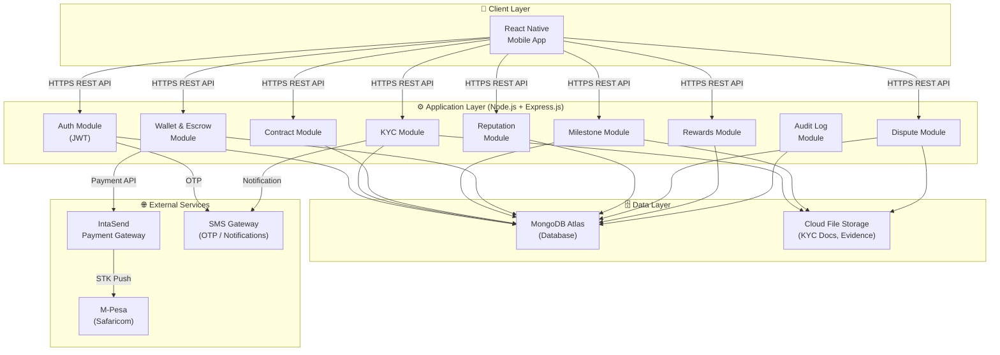
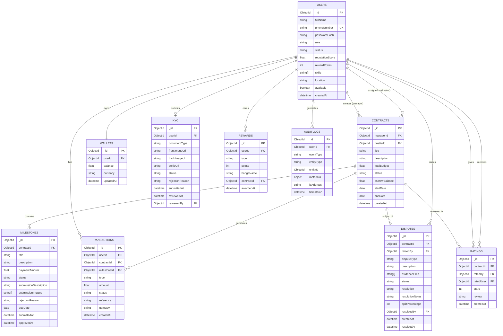
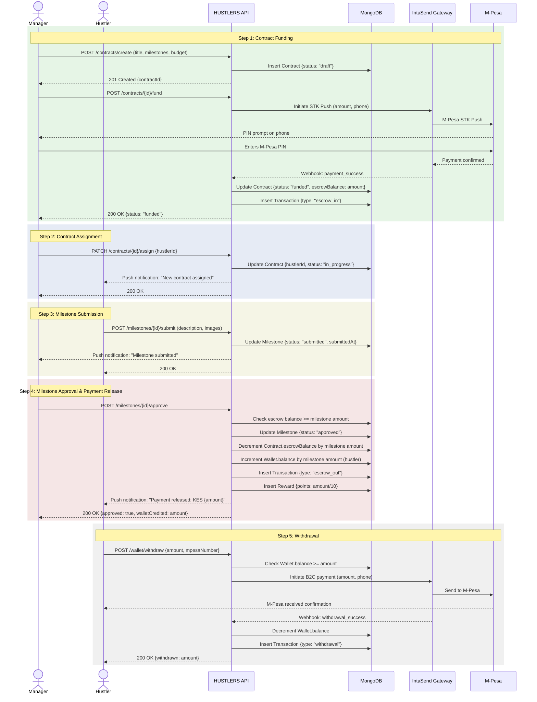
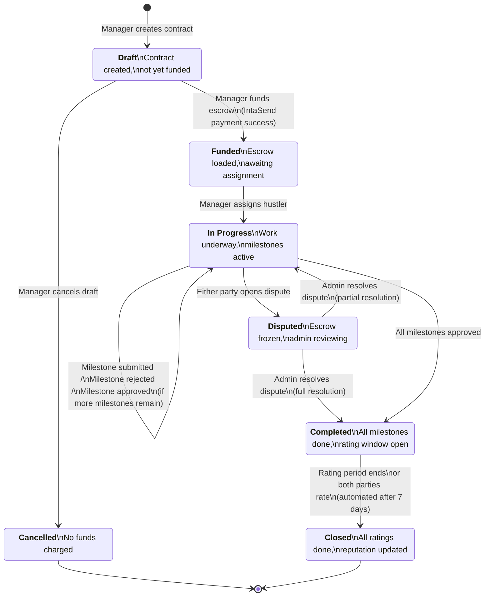
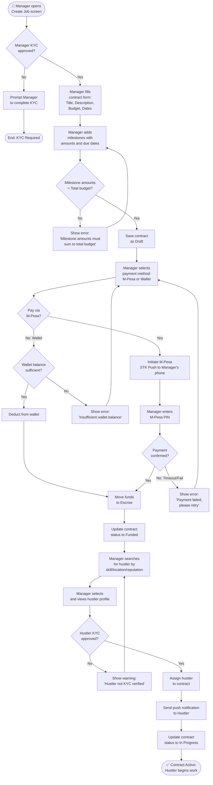

```mermaid
graph LR
    Hustler(("👷 Hustler"))
    Manager(("💼 Manager"))
    Admin(("🔐 Admin"))

    subgraph HUSTLERS_Platform ["HUSTLERS Platform"]
        Register["Register Account"]
        Login["Login"]
        SubmitKYC["Submit KYC Documents"]
        ViewProfile["View Profile"]
        EditProfile["Edit Profile"]

        CreateContract["Create Contract"]
        FundContract["Fund Contract via\nM-Pesa Escrow"]
        AssignContract["Assign Contract\nto Hustler"]
        ViewContracts["View Contracts"]

        SubmitMilestone["Submit Milestone\nProof of Work"]
        ApproveMilestone["Approve Milestone"]
        RejectMilestone["Reject Milestone"]

        ViewWallet["View Wallet Balance"]
        Withdraw["Withdraw Funds\nto M-Pesa"]
        Deposit["Deposit Funds"]

        SearchWorkers["Search & Discover\nWorkers"]
        ViewWorkerProfile["View Worker Profile"]
        RateWorker["Rate Worker"]

        EarnPoints["Earn Reward Points"]
        ViewBadges["View Badges"]
        ViewLeaderboard["View Leaderboard"]

        OpenDispute["Open Dispute"]
        ReviewDispute["Review & Resolve\nDispute"]
        ReviewKYC["Review KYC\nSubmissions"]
        ViewAuditLog["View Audit Logs"]
    end

    Hustler --> Register
    Hustler --> Login
    Hustler --> SubmitKYC
    Hustler --> ViewProfile
    Hustler --> EditProfile
    Hustler --> ViewContracts
    Hustler --> SubmitMilestone
    Hustler --> ViewWallet
    Hustler --> Withdraw
    Hustler --> EarnPoints
    Hustler --> ViewBadges
    Hustler --> ViewLeaderboard
    Hustler --> OpenDispute

    Manager --> Register
    Manager --> Login
    Manager --> SubmitKYC
    Manager --> ViewProfile
    Manager --> CreateContract
    Manager --> FundContract
    Manager --> AssignContract
    Manager --> ViewContracts
    Manager --> ApproveMilestone
    Manager --> RejectMilestone
    Manager --> SearchWorkers
    Manager --> ViewWorkerProfile
    Manager --> RateWorker
    Manager --> Deposit
    Manager --> ViewWallet
    Manager --> OpenDispute

    Admin --> ReviewKYC
    Admin --> ReviewDispute
    Admin --> ViewAuditLog
    Admin --> ViewContracts
```

# PART 4 — SYSTEM DIAGRAMS

**Project:** HUSTLERS — Informal Job Agreement & Payment Tracker Platform  
**Version:** 1.0  
**Date:** March 2026  
**Diagram Format:** Mermaid  

---

## 4.1 System Architecture Diagram

### Description

The HUSTLERS system follows a three-tier mobile application architecture. The **Presentation Layer** is a React Native mobile app consumed by Hustlers, Managers, and Administrators. The **Application Layer** is a Node.js/Express.js REST API that orchestrates all business logic, authentication, payment processing, and data access. The **Data Layer** is a MongoDB Atlas instance. External integrations include the IntaSend Payment Gateway (for M-Pesa transactions and escrow management) and an SMS Gateway (for OTP delivery and notifications).

---

## 4.2 Use Case Diagram

### Description

The Use Case Diagram identifies the three primary actors (Hustler, Manager, Administrator) and their interactions with the HUSTLERS platform. The diagram shows all major use cases and the relationships between actors and system functionality. The Administrator inherits access to all user-facing features for support purposes, shown via `<<extend>>` relationships where admin functionality extends base user actions.

---

## 4.3 Entity Relationship Diagram

### Description

The ERD models the core data entities and their relationships. **Users** can be Hustlers or Managers. A Manager creates **Contracts**; each Contract has one or more **Milestones**. A Hustler is assigned to a Contract. **Wallets** are associated with users; **Transactions** record all financial movements. **Disputes** are raised against Contracts. **Rewards** track points and badges per user. **AuditLogs** record all system events.

---

## 4.4 Job Payment Sequence Diagram

### Description

This sequence diagram illustrates the complete end-to-end workflow of a single milestone payment, from contract funding through to the hustler's wallet credit. It shows the interactions between the Manager, Hustler, the HUSTLERS API, the MongoDB database, and the IntaSend payment gateway.

---

## 4.5 Contract Lifecycle State Machine

### Description

The Contract State Machine defines all valid states a contract can occupy and the transitions between them. Invalid state transitions are rejected by the API with a `400 Bad Request` response. This ensures contractual integrity throughout the platform.

---

## 4.6 Job Creation Activity Diagram

### Description

This activity diagram models the complete workflow from when a manager initiates job creation to when a hustler begins working. It includes decision nodes for KYC verification status checks, escrow payment confirmation, and hustler assignment.

---

*End of Part 4 — System Diagrams*
