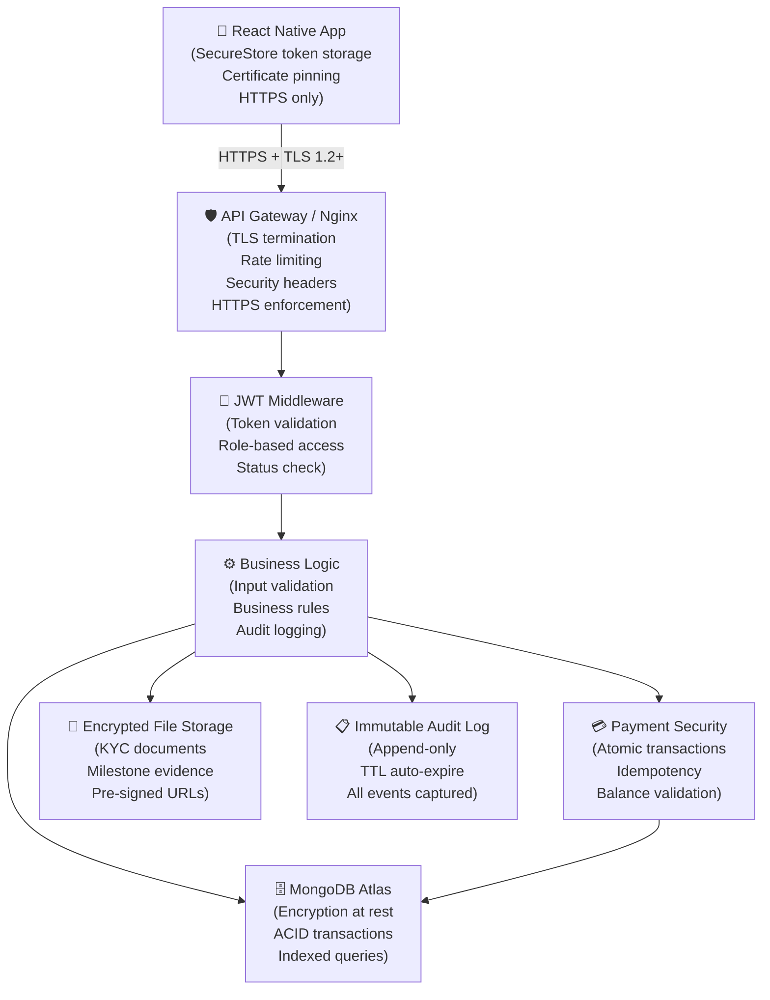

# PART 7 — SECURITY ARCHITECTURE

**Project:** HUSTLERS — Informal Job Agreement & Payment Tracker Platform  
**Version:** 1.0  
**Date:** March 2026  

---

## Overview

Security is a foundational concern for the HUSTLERS platform given its handling of financial transactions, personal identity documents, and user funds. The security architecture is designed around the following core principles:

1. **Defence in Depth:** Multiple independent security layers ensure that failure of one layer does not compromise the system.
2. **Principle of Least Privilege:** Each system component and user has the minimum permissions required to perform its function.
3. **Zero Trust Networking:** All inter-service communication is authenticated and encrypted regardless of network position.
4. **Data Minimisation:** Only the minimum necessary personal data is collected and retained.
5. **Auditability:** All security-relevant events are logged immutably for forensic review.

---

## 7.1 Authentication — JWT (JSON Web Tokens)

### Architecture

The HUSTLERS platform uses **stateless JWT authentication** for all API requests. The token lifecycle is as follows:

```
User Login → Server validates credentials → Server issues:
  - Access Token (short-lived: 24 hours)
  - Refresh Token (long-lived: 7 days)
    ↓
Client stores tokens securely on device (React Native SecureStore)
    ↓
Each API request includes: Authorization: Bearer <accessToken>
    ↓
Server validates token signature, expiry, and user status
    ↓
On access token expiry → Client uses refresh token to obtain new access token
    ↓
On logout → Refresh token blacklisted server-side
```

### Token Structure

**Access Token Payload:**
```json
{
  "sub": "64f3a1b2c3d4e5f6a7b8c9d0",
  "role": "hustler",
  "status": "kyc_approved",
  "iat": 1709374800,
  "exp": 1709461200
}
```

**Security Controls:**

| Control | Implementation |
|---|---|
| Signing algorithm | HS256 (HMAC-SHA256) with 256-bit secret key |
| Access token expiry | 24 hours |
| Refresh token expiry | 7 days |
| Secret key storage | Environment variable (never hardcoded) |
| Refresh token blacklist | Redis or MongoDB TTL collection |
| Token rotation | New refresh token issued on each refresh |

### Token Validation Middleware

Every protected route passes through a JWT validation middleware that:

1. Extracts the `Authorization: Bearer <token>` header.
2. Verifies token signature using the server secret.
3. Checks token expiry (`exp` claim).
4. Loads the user from the database to validate current `status` (prevents suspended users from using valid tokens).
5. Attaches `req.user` for downstream handlers.

### Anti-Patterns Avoided

- Tokens are **never** stored in `localStorage` (XSS risk); React Native `SecureStore` (hardware-backed on supported devices) is used.
- Sensitive data (passwords, card numbers) is **never** included in JWT payloads.
- Token secret is **never** hardcoded; it is loaded from environment variables.

---

## 7.2 Password Security

### Hashing

User passwords are hashed using **bcrypt** with a minimum cost factor of **10**. bcrypt is preferred over SHA-256 for password storage because:

- It is intentionally slow, making brute-force attacks computationally expensive.
- It incorporates a random salt per password, preventing rainbow table attacks.
- The cost factor can be increased as hardware improves.

```javascript
// Password hashing on registration
const passwordHash = await bcrypt.hash(plainPassword, 10);

// Password verification on login
const isValid = await bcrypt.compare(plainPassword, storedHash);
```

**The plaintext password is never logged, stored, or transmitted after initial receipt.**

### Brute-Force Protection

Failed login attempts are tracked per user account:
- After **5 failed attempts**, the account is locked for **15 minutes**.
- A notification is sent to the user's registered phone number on account lock.
- Lockout state is stored in the user document (`failedLoginAttempts`, `lockedUntil`).

Additionally, **rate limiting** is applied at the API gateway level:
- Authentication endpoints: **10 requests per minute per IP address**.
- All other endpoints: **100 requests per minute per IP address**.

---

## 7.3 Transport Security — HTTPS

All communication between the React Native client and the HUSTLERS API uses **HTTPS with TLS 1.2 or higher**. This protects against:

- **Eavesdropping:** All request/response data is encrypted in transit.
- **Man-in-the-Middle (MITM) attacks:** TLS certificate validation prevents traffic interception.

### Implementation Details

- **Certificate:** Obtained from a trusted CA (e.g., Let's Encrypt) and renewed automatically.
- **HSTS:** HTTP Strict Transport Security header enforced to prevent HTTP downgrades:
  ```
  Strict-Transport-Security: max-age=31536000; includeSubDomains
  ```
- **Certificate Pinning:** The React Native application pins the server certificate to prevent MITM attacks even with a compromised CA.
- **TLS Configuration:** TLS 1.0 and 1.1 are disabled at the server level (Nginx/Apache configuration).

---

## 7.4 Escrow Transaction Atomicity

### The Problem

Payment operations involve multiple database writes (e.g., decrement escrow balance, increment wallet balance, insert transaction record). If any write fails mid-operation, the system could be left in an inconsistent state (e.g., funds debited from escrow but not credited to wallet).

### Solution: MongoDB Multi-Document Transactions

All financial operations use **MongoDB multi-document ACID transactions** to guarantee atomicity:

```javascript
const session = await mongoose.startSession();
session.startTransaction();

try {
  // Decrement escrow
  await Contract.findByIdAndUpdate(
    contractId,
    { $inc: { escrowBalance: -milestoneAmount } },
    { session }
  );

  // Credit hustler wallet
  await Wallet.findOneAndUpdate(
    { userId: hustlerId },
    { $inc: { balance: milestoneAmount } },
    { session }
  );

  // Record transaction
  await Transaction.create([{
    userId: hustlerId,
    type: 'escrow_out',
    amount: milestoneAmount,
    contractId,
    milestoneId,
    status: 'completed'
  }], { session });

  await session.commitTransaction();
} catch (error) {
  await session.abortTransaction();
  throw error;
} finally {
  session.endSession();
}
```

If any operation throws an error, the entire transaction is rolled back. The platform never enters a state where money is "lost" between accounts.

### IntaSend Webhook Idempotency

IntaSend payment confirmation events are delivered via webhooks. To prevent double-processing:

- Each webhook includes a unique `gatewayReference` transaction ID.
- Before processing, the system checks if a transaction with this reference already exists.
- If found, the webhook is acknowledged but not reprocessed (idempotent handler).

---

## 7.5 Secure Wallet Operations

### Input Validation

All financial input is strictly validated:
- Amounts must be positive numbers.
- Minimum withdrawal is KES 50.
- Maximum single withdrawal is KES 70,000 (CBK daily limit).
- M-Pesa phone numbers are validated against the Kenyan E.164 format (`+2547XXXXXXXX`).

### Balance Checks

Wallet debits are only permitted when:
- The balance check and debit occur within the **same database transaction** (atomic check-then-act).
- This prevents race conditions where two concurrent requests both pass the balance check before either debit executes (the TOCTOU problem).

### Wallet Isolation

- Each user has exactly **one wallet** document (enforced by a unique index on `userId`).
- Wallet documents are only modified through dedicated service functions, never through raw database access in route handlers.
- Negative balances are prevented at the database schema level (`min: 0` constraint) and at the application validation layer.

---

## 7.6 KYC Document Security

User identity documents are highly sensitive. The following controls are applied:

| Control | Implementation |
|---|---|
| Storage | Encrypted cloud object storage (e.g., AWS S3 with SSE-S3 encryption) |
| Access | Pre-signed URLs with 15-minute expiry; documents not publicly accessible |
| Transit | HTTPS for upload and download |
| Retention | Documents retained for 5 years per Kenyan AML regulations; auto-deleted thereafter |
| Access control | Only admin users can request pre-signed document URLs |
| Audit | Every document access is logged in `auditlogs` |

---

## 7.7 Audit Logging

### Purpose

The audit log provides a tamper-evident record of all security-relevant events. It is used for:

- **Security monitoring:** Detecting unusual patterns (e.g., multiple failed logins, rapid withdrawals).
- **Compliance:** Demonstrating regulatory adherence to CBK and data protection authorities.
- **Dispute resolution:** Providing an objective timeline of events to support admin decisions.
- **Forensic investigation:** Reconstructing the sequence of events following a security incident.

### What Is Logged

All of the following events create an audit log entry:

| Category | Events |
|---|---|
| Authentication | Login, failed login, password reset, account lock, logout |
| KYC | Document submission, approval, rejection |
| Contracts | Created, funded, assigned, completed, closed, cancelled |
| Milestones | Submitted, approved, rejected |
| Financial | Payment initiated, completed, failed; wallet credited, debited; withdrawal |
| Disputes | Opened, reviewed, resolved |
| Admin | Any action taken by an admin user |

### Log Immutability

- Audit log documents have **no update or delete paths** in the application code.
- The `auditlogs` MongoDB collection uses an **append-only service function**; no other code path writes to it.
- A MongoDB TTL index auto-deletes entries older than 2 years (configurable per regulatory requirement).
- For critical compliance scenarios, logs can be exported to immutable cold storage (e.g., AWS S3 Glacier).

---

## 7.8 Fraud Prevention

### Real-Time Anomaly Detection

The system implements rule-based fraud detection that flags suspicious activity for admin review:

| Rule | Threshold | Action |
|---|---|---|
| Rapid successive withdrawals | > 3 in 10 minutes | Flag account, notify admin |
| Large single withdrawal | > KES 50,000 | Require additional OTP confirmation |
| Multiple failed logins from new device | > 5 in 15 minutes | Lock account, alert user |
| Contract funding from unverified M-Pesa | — | Block and notify |
| KYC resubmission after 2 rejections | — | Flag for manual review |

### KYC as a Trust Gate

Full platform functionality (contract creation, escrow funding, large withdrawals) requires KYC approval. This ensures:

- All significant financial actors have verified identities.
- Bad actors cannot create anonymous accounts for fraudulent contracts.

### Rate Limiting

Rate limiting is enforced at the API gateway layer (Nginx or Express rate limiter):

```
POST /auth/login:        10 req/min per IP
POST /auth/register:     5 req/min per IP
POST /wallet/withdraw:   3 req/hour per user
All others:              100 req/min per IP
```

---

## 7.9 API Security Headers

All API responses include standard security headers:

```
X-Content-Type-Options: nosniff
X-Frame-Options: DENY
X-XSS-Protection: 1; mode=block
Strict-Transport-Security: max-age=31536000; includeSubDomains
Content-Security-Policy: default-src 'none'
Referrer-Policy: no-referrer
Cache-Control: no-store
```

These are implemented via the **Helmet.js** middleware in Express.js.

---

## 7.10 Data Privacy and Compliance

### Data Minimisation

- Only data necessary for platform operation is collected.
- KYC document images are not analysed programmatically; they are stored for human review only.
- User location is a free-text field, not GPS coordinates (no precise geolocation collected).

### Data Encryption at Rest

- MongoDB Atlas encryption at rest is enabled (AES-256).
- KYC documents stored in encrypted cloud storage (SSE-AES-256).

### Kenya Data Protection Act (2019) Compliance

- Users are presented with a clear Privacy Notice at registration.
- Users may request deletion of their data (subject to financial regulatory retention requirements).
- Data is processed only for stated platform purposes.
- No personal data is shared with third parties without user consent, except as required by law.

---

## Security Architecture Summary



---

*End of Part 7 — Security Architecture*
