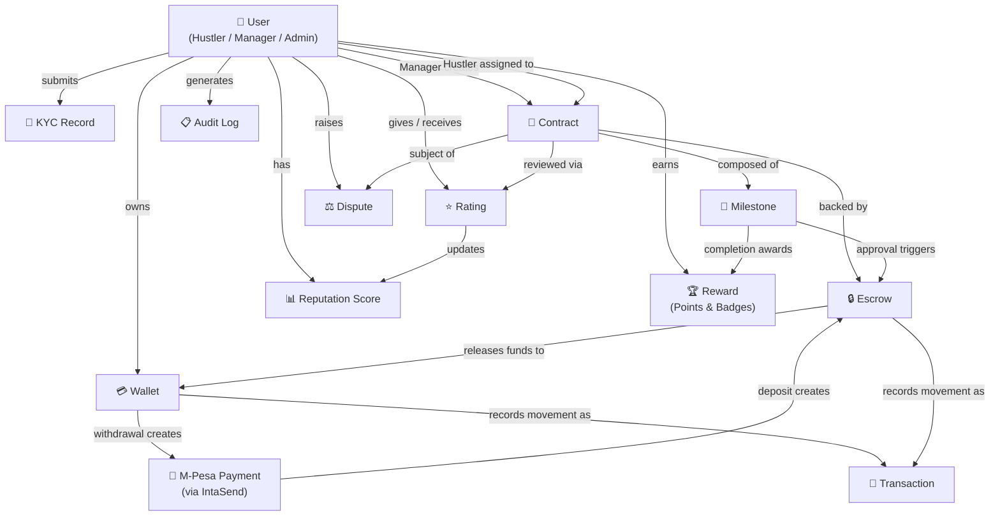
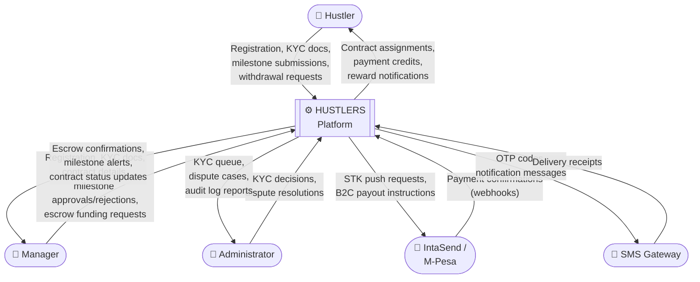
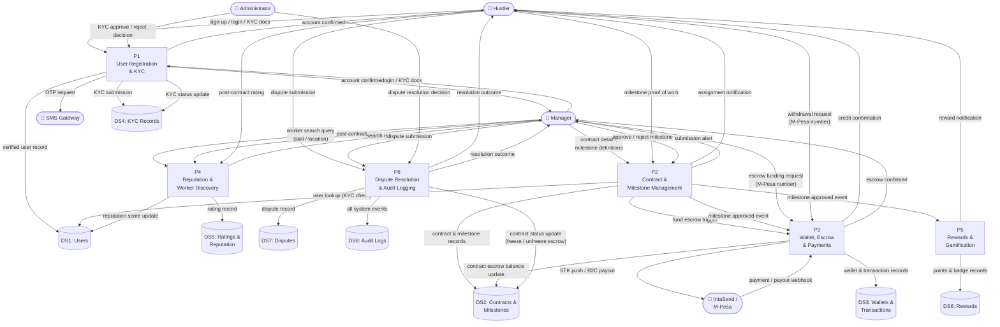

# PART 8 — CONCEPTUAL DIAGRAM & DATA FLOW DIAGRAMS

**Project:** HUSTLERS — Informal Job Agreement & Payment Tracker Platform  
**Version:** 1.0  
**Date:** March 2026  
**Diagram Format:** Mermaid  

---

## 8.1 Conceptual Diagram

### Description

The Conceptual Diagram presents the core business concepts of the HUSTLERS platform and the meaningful relationships between them, independent of any technical implementation. It captures the domain vocabulary shared by all stakeholders:

| Concept | Meaning |
|---|---|
| **User** | Any person registered on the platform — can act as a Hustler (worker), a Manager (job poster), or an Administrator |
| **KYC Record** | Identity verification documents submitted by a User to unlock payment features |
| **Contract** | A digital job agreement created by a Manager that specifies the work, budget, and timeline |
| **Milestone** | A discrete, verifiable unit of work within a Contract, each carrying its own payment amount |
| **Escrow** | Funds held in trust by the platform after a Manager pays and before a Hustler earns |
| **Wallet** | A platform-held digital balance belonging to a User, funded by escrow releases |
| **Transaction** | A financial event (escrow top-up, milestone payout, deposit, or withdrawal) |
| **Rating** | A post-contract evaluation one party gives another, feeding into Reputation |
| **Reputation Score** | A computed score per User derived from their ratings and milestone track record |
| **Reward** | Points and badges awarded to Hustlers for completing milestones; drive the Leaderboard |
| **Dispute** | A formal objection raised by either party against a Contract, pausing escrow release |
| **Audit Log** | An immutable record of every significant system event for accountability and compliance |

---

## 8.2 Data Flow Diagram — Level 0 (Context Diagram)

### Description

The Level-0 DFD (Context Diagram) treats the entire HUSTLERS platform as a **single process** and shows the external entities that interact with it, together with the high-level data flows crossing the system boundary.

| External Entity | Role |
|---|---|
| **Hustler** | Receives contracts, submits milestone work, earns and withdraws money |
| **Manager** | Creates contracts, funds escrow, reviews milestone submissions |
| **Administrator** | Reviews KYC documents, resolves disputes, monitors audit logs |
| **IntaSend / M-Pesa** | Processes inbound payments (escrow top-up) and outbound disbursements (withdrawals) |
| **SMS Gateway** | Delivers OTP codes and push notifications |

---

## 8.3 Data Flow Diagram — Level 1 (Major Processes)

### Description

The Level-1 DFD decomposes the HUSTLERS platform into its **six major process groups** and shows how data flows between them, the data stores they read from or write to, and the external entities they interface with. Each numbered process corresponds to a core system module.

| Process | Description |
|---|---|
| **P1 — User Registration & KYC** | Handles sign-up, login, identity verification, and admin KYC review |
| **P2 — Contract & Milestone Management** | Manages contract creation, hustler assignment, milestone lifecycle, and work submission |
| **P3 — Wallet, Escrow & Payments** | Orchestrates escrow funding, milestone payout, deposits, and M-Pesa withdrawals |
| **P4 — Reputation & Worker Discovery** | Calculates reputation scores, manages ratings, and powers worker search |
| **P5 — Rewards & Gamification** | Awards points and badges when milestones are completed; maintains leaderboard |
| **P6 — Dispute Resolution & Audit Logging** | Handles dispute creation, admin adjudication, and writes all events to the audit log |

---

*End of Part 8 — Conceptual Diagram & Data Flow Diagrams*
